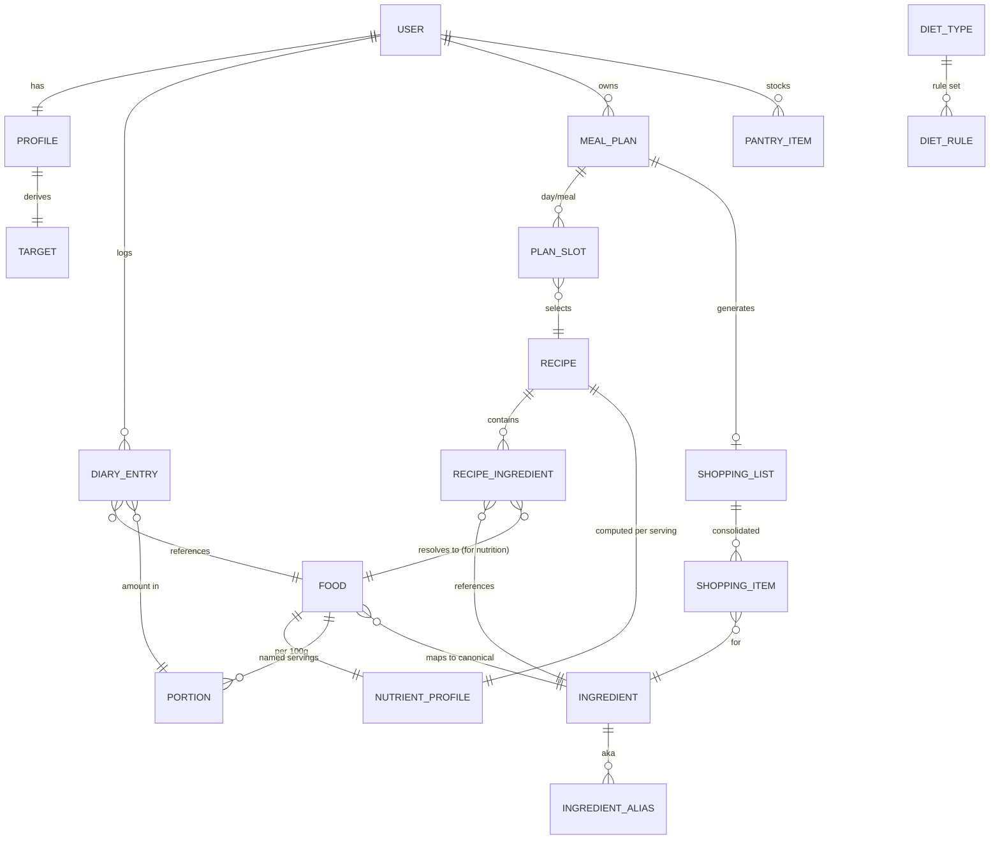

# Architecture: Data Model

The core entities, shared by all three pillars. The whole system hangs off two foundations: the **canonical food/nutrient** model and the **canonical ingredient** model.

---

## 1. Entity-relationship overview



---

## 2. The food / nutrient core

### `Food`
A single nutrition-bearing entity (generic or branded), imported from an external source.

| Field | Type | Notes |
|---|---|---|
| `id` | uuid | |
| `name` | text | "Banana, raw" / "Cheerios, General Mills" |
| `brand` | text? | null for generic |
| `gtin` | text? | UPC/barcode, indexed (Branded/Open Food Facts) |
| `canonicalIngredientId` | uuid? | links to `Ingredient` for recipe nutrition |
| `verificationStatus` | enum | `foundation` \| `authoritative` \| `community` \| `user-submitted` |
| `source` | json | `{ provider, providerId }` — provenance, unique key for upsert |

### `NutrientProfile` (per 100 g / 100 ml)
The canonical nutrient vector — every source normalizes into this on import.

```
energyKcal, protein_g, fat_g, saturatedFat_g, carbohydrate_g, sugars_g,
fiber_g, sodium_mg, [optional nullable micros: vitamins, minerals...]
```

Macros required; micros nullable (Open Food Facts often lacks them — degrade gracefully, never drop the food).

### `Portion`
Maps a human-named serving → grams. Imported from USDA `foodPortion`; without these, users must weigh everything.

```
foodId, name ("1 medium", "1 cup mashed"), grams
```

---

## 3. The canonical ingredient core (powers batch cooking)

### `Ingredient` (canonical)
The de-duplication anchor. "chicken breast", "boneless skinless chicken breast", "chicken breasts" → **one** `Ingredient`.

| Field | Type | Notes |
|---|---|---|
| `id` | uuid | |
| `canonicalName` | text | "chicken breast" |
| `category` | enum | maps to store aisle (produce, dairy, meat, pantry, frozen…) |
| `density_g_per_ml` | number? | enables volume↔mass conversion in consolidation |
| `preferredUnit` | enum | display unit for shopping list |
| `defaultFoodId` | uuid? | the `Food` used for nutrition when a recipe line resolves here |

### `IngredientAlias`
`ingredientId, alias` — the alias list that makes entity resolution work (later augmentable with embeddings).

---

## 4. Recipes & batch cooking

### `Recipe` (schema.org/Recipe-aligned)
```
id, name, description, image, recipeYield (base servings),
prepTimeMin, cookTimeMin, totalTimeMin, cuisine, keywords[],
suitableForDiet[]  (VeganDiet, LowCarbDiet, ...),
nutritionPerServing → NutrientProfile  (COMPUTED, never copied from source)
```

### `RecipeIngredient` (parsed line)
```
recipeId, rawText ("2 large eggs, beaten"),
quantity, unit, ingredientId (canonical), foodId (for nutrition), note
```

> **Computed nutrition rule:** `Recipe.nutritionPerServing = (Σ RecipeIngredient → Food nutrients × grams) / recipeYield`. This keeps recipe macros consistent with the tracker and trustworthy for the solver. See [batch-cooking research](../research/02-batch-cooking.md).

---

## 5. Tracking (calorie diary)

### `User` / `Profile`
```
User: id, email, authRefs
Profile: userId, sex, birthDate, height_cm, weight_kg, bodyFatPct?,
         activityLevel, goal (cut/maintain/bulk + rate),
         macroStrategy (protein-anchored | percentage),
         allergens[], dislikes[], preferredDiets[]
```

### `Target` (derived, not stored as source-of-truth)
Computed by `NutritionTargets` from `Profile` ([tdee-and-macros](../algorithms/tdee-and-macros.md)). Cache it, recompute on profile change.
```
userId, kcal, protein_g, fat_g, carb_g, computedAt, formula
```

### `DiaryEntry`
```
userId, date, mealSlot (breakfast/lunch/dinner/snack), sequence,
foodId, portionId, quantity,
snapshot: { kcal, p, f, c }   ← denormalized at log time (food data may change later)
```

**Snapshot the nutrition at log time.** If a `Food` is later corrected, historical diary days must not silently change — log the computed macros onto the entry.

---

## 6. Diet generation outputs

### `DietType` + `DietRule` (diets as data)
```
DietType: id, name (Vegan, Keto, Halal...)
DietRule: dietTypeId, kind (excludeCategory | excludeIngredient | macroConstraint | requireTag),
          value (e.g. category=meat; or carbPercentMax=10)
```
Adding a diet = inserting rows, not deploying code. See [diet-generation research](../research/03-diet-generation.md) §5.

### `MealPlan` / `PlanSlot`
```
MealPlan: id, userId, intent (DietIntent json), horizonDays, status, createdAt
PlanSlot: planId, day, mealSlot, recipeId, servings
```
A `MealPlan` is the bridge object: it satisfies a `DietIntent`, references `Recipe`s, and feeds the shopping list directly.

### `ShoppingList` / `ShoppingItem`
```
ShoppingList: id, planId, generatedAt
ShoppingItem: listId, ingredientId, totalQuantity, unit, aisleCategory, pantryCovered (bool)
```

### `PantryItem`
```
userId, ingredientId, quantity, unit  → subtracted during list generation
```

---

## 7. Storage choices

| Data | Store | Why |
|---|---|---|
| Foods, recipes, diary, plans | **PostgreSQL** | Relational integrity; full-text search for food lookup; JSONB for flexible nutrient/intent blobs |
| Food search, parse cache, intent cache, sessions | **Redis** | Sub-ms reads on the hot path; offloads Postgres FTS |
| (later) fuzzy ingredient matching | **pgvector** | Embedding similarity for ingredient entity resolution |

EF Core code-first migrations; one `DbContext` per bounded context sharing the database, or schema-per-context for cleaner boundaries.

---

See also: [system-design](system-design.md) · [api-design](api-design.md).
